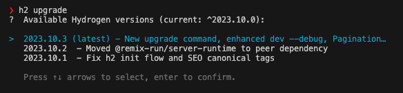
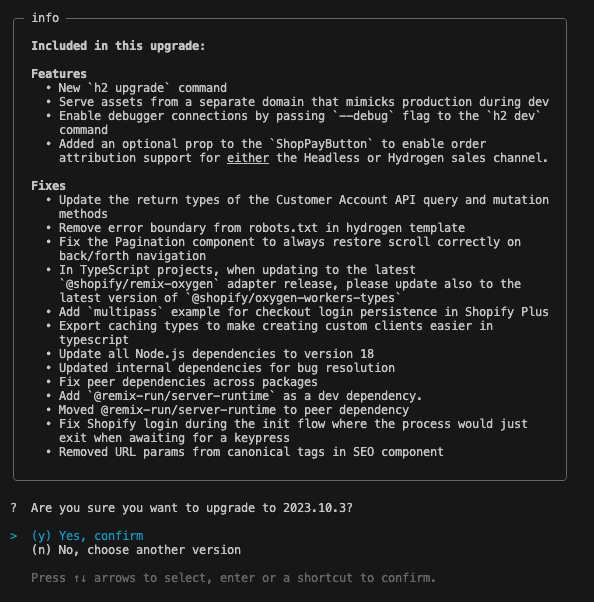
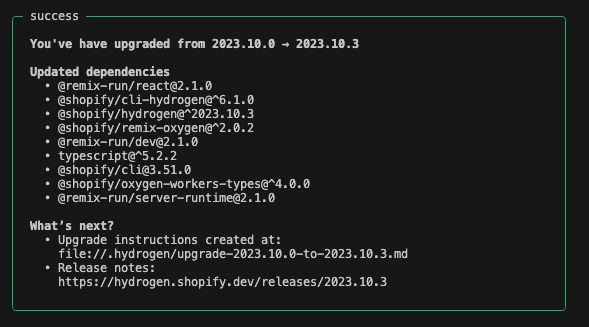

# Upgrading Hydrogen

Upgrading to the latest version of Hydrogen is made simple when using the [Shopify Hydrogen CLI](https://shopify.dev/docs/custom-storefronts/hydrogen/cli).

## Upgrade prerequisites

- Version of the Hydrogen CLI that supports the upgrade command: `>= @shopify/cli-hydrogen@6.1.0`

## Steps to upgrade

1. Create and checkout a new branch as the upgrade command can only be run on a clean branch
1. Run the Hydrogen upgrade command:

   ```
   h2 upgrade
   ```

1. Select the version of Hydrogen you would like to upgrade

   

1. Review the upgrade changes and confirm to continue

   

1. Confirm the upgrade was a success from the "success" output

   

1. Stage and commit any file changes to the branch

## Upgrade instructions

An upgrade instruction is created when running the upgrade command. This provides a more detailed view of what has changed between the upgrade versions.

Upgrade instructions can be found in the `.hydrogen` directory at the root of the project e.g. [.hydrogen/upgrade-2023.10.0-to-2023.10.3.md](../../.hydrogen/upgrade-2023.10.0-to-2023.10.3.md)
